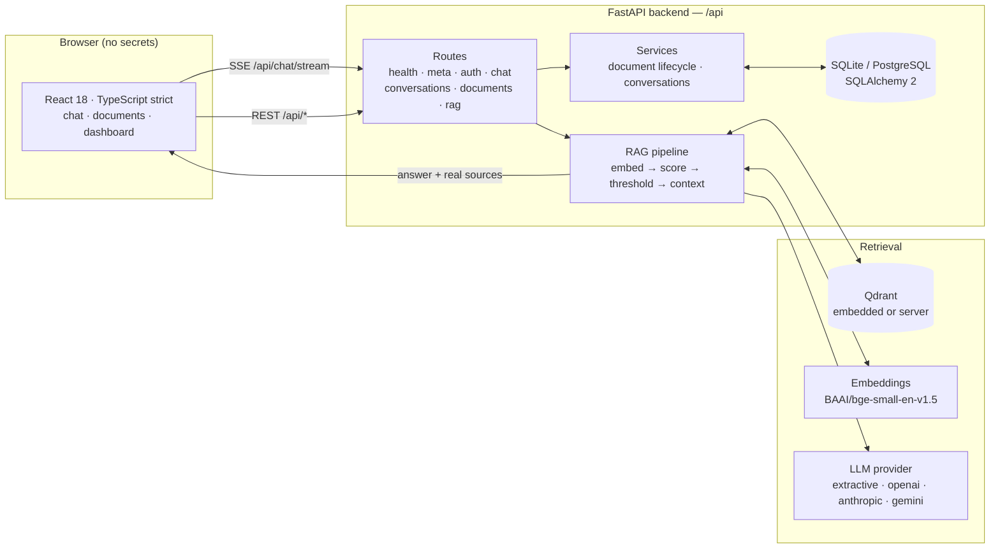
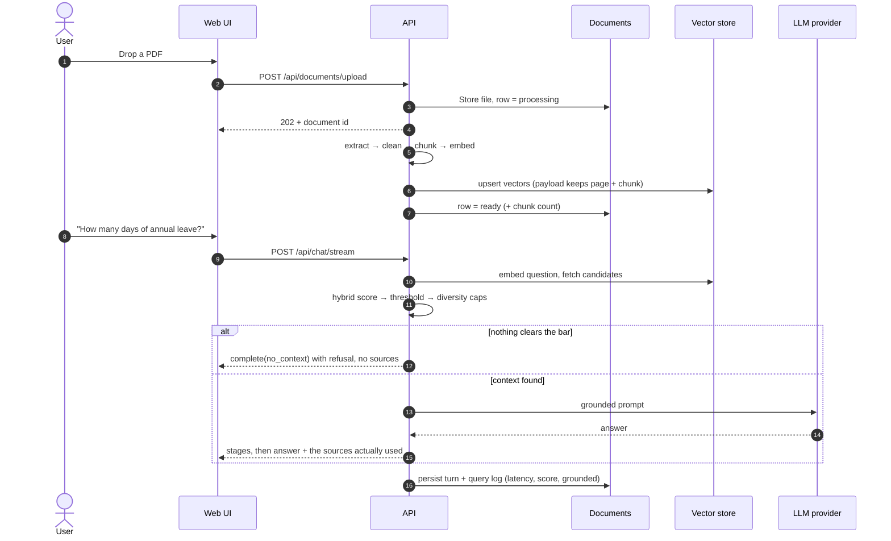
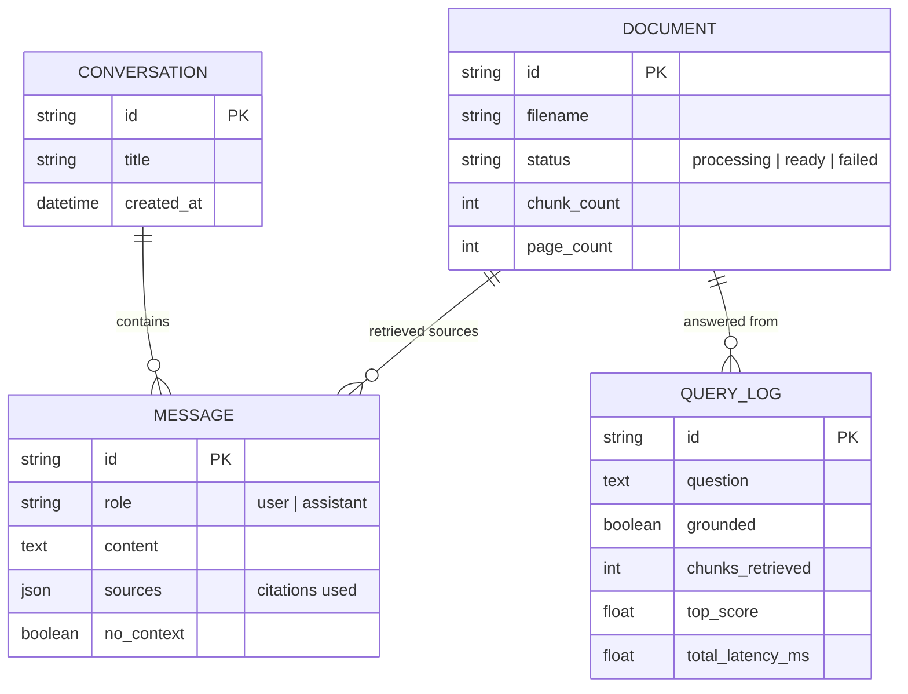

<div align="center">


# HR Nexus

**An intelligent HR knowledge assistant that answers only from your own documents — and says so when it cannot.**

[](https://www.python.org/)
[](https://fastapi.tiangolo.com/)
[](https://react.dev/)
[](https://www.typescriptlang.org/)
[](https://qdrant.tech/)
[](backend/tests)
[](frontend/src/test)
[](backend/evaluation)
[](backend/tests/smoke.py)
[](LICENSE)

[](https://github.com/hr-nexus/hr-nexus/commits/main)
[](https://github.com/hr-nexus/hr-nexus/issues)

Upload an HR policy, handbook or benefits guide. Ask a question in plain language.
Get an answer with the exact passages it came from, or a clear refusal when the
knowledge base does not cover it.

[Quickstart](#quickstart) · [Architecture](#architecture) · [How it answers](#how-it-answers-grounding-not-generation) · [Modes](#standalone-vs-integration) · [Configuration](#configuration) · [Deployment](#deployment) · [API](#api-reference) · [Docs](#documentation)

</div>

---

## Why this exists

Most HR chatbots have the same failure mode: they answer every question, fluently,
whether or not the answer is in the handbook. An employee asking about parental
leave gets a confident paragraph assembled from a benefits PDF, an onboarding
guide and the model's own priors — and nobody notices until it is quoted back in a
case.

HR Nexus is built the other way around. Retrieval decides whether an answer
exists; generation only rephrases what retrieval found. There is no prompt that
can talk the model into answering a question the knowledge base does not cover,
because when nothing clears the relevance bar the pipeline returns a refusal
*without calling a model at all*.

| | |
| --- | --- |
| **Grounded by construction** | Answers are assembled from retrieved chunks; the sources returned are the chunks actually used |
| **Refuses honestly** | Below-threshold retrieval returns a refusal, not a guess. Verified on 6 out-of-scope questions |
| **Fully offline** | SQLite, embedded Qdrant and a local embedding model by default — no cloud account, no API key |
| **Citation-first UI** | Every answer carries expandable source cards: filename, page, chunk, relevance score, snippet |
| **Real telemetry** | The dashboard shows actual vector-store and query metrics, never invented numbers |

---

## Quickstart

### With Docker (one command)

```bash
git clone <your-fork-url> hr-nexus && cd hr-nexus
docker compose up --build
```

Open **<http://localhost:8080>**. API docs: **<http://localhost:8000/docs>**.

No configuration is required: the stack defaults to SQLite, an embedded vector
store and offline answer mode. To use your own `.env`, copy `.env.docker.example`.

### Without Docker

Requires Python 3.11+ and Node 18+.

```bash
# 1. Backend
cd backend
python -m venv .venv && source .venv/bin/activate   # Windows: .venv\Scripts\activate
pip install -r requirements.txt
uvicorn app.main:app --reload --port 8000

# 2. Sample corpus (7 clearly fictional HR policies)
cd ..
python scripts/seed_documents.py

# 3. Frontend
cd frontend && npm install && npm run dev
```

Open **<http://localhost:5173>**. The dev server proxies `/api` to port 8000, so
the browser only ever talks to one origin.

<details>
<summary>What the scripts do</summary>

| Command | Effect |
| --- | --- |
| `python scripts/generate_sample_documents.py` | Writes 7 fictional PDFs/Markdown policies into `data/documents/`. The files are already committed; regenerate only if you want to rebuild them. |
| `python scripts/seed_documents.py` | Indexes every document in `data/documents/` into the vector store and prints a summary. Safe to re-run. |
| `python scripts/check_dev_db.py` | Prints the resolved database path, table row counts and any column the schema is missing. The first thing to check when the dashboard shows zeros. |

</details>

### First run, end to end

1. **Documents** → drop in a PDF. The row moves `Queued → Indexing → Ready`.
2. **Chat** → *How many days of annual leave do I get per year?* The answer is
   cited to `fictional_leave_policy.pdf`, page 1.
3. **Chat** → *What is our confidential equity vesting schedule?* The assistant
   refuses, and attaches no sources.
4. **History** → reopen either thread; the URL follows the conversation.
5. **Dashboard** → real document, chunk, vector and query counts.

---

## Architecture

Two processes, one origin for the browser. The frontend never holds a secret and
never talks to a third party; every call goes to `/api` on its own host.



### Ingestion and retrieval data flow



### Data model



Full component and design rationale: **[docs/ARCHITECTURE.md](docs/ARCHITECTURE.md)**.

---

## Standalone vs integration

HR Nexus ships as a **standalone application**: one command, one origin, its own
database, its own vector store. It is the deployment mode everything in this
repository is tested in.

| | Standalone (**default, shipped**) | Integration (**planned — not implemented**) |
| --- | --- | --- |
| Shape | Full app: UI + API + storage | Embed the retrieval/generation pipeline inside another product |
| Entry points | `docker compose up --build`, or `uvicorn app.main:app` | *none yet* — no published library entry point, no plugin hook, no webhook |
| Auth | One optional shared `API_AUTH_TOKEN` guarding writes | *planned*: per-user identity mapped to row-level scoping |
| Data | Own documents, own conversations, own database | *planned*: a host application's own document store |
| UI | Bundled React app | *planned*: headless usage via the existing `/api` contract |
| Status | Verified — 41 unit tests, 32/32 evaluation, 50/50 smoke, 40 frontend tests | **Planned only. Nothing in this repository implements it.** |

To use the retrieval capability inside another system today, the supported route
is the HTTP contract in [API reference](#api-reference) — call `/api/documents/upload`
then `/api/chat`, and read `sources` back. That is the same surface the bundled
UI uses; no private endpoints are required.

---

## How it answers (grounding, not generation)

```
upload ──▶ extract ──▶ clean ──▶ chunk ──▶ embed ──▶ Qdrant
                                                        │
question ──▶ embed ──▶ 30 candidates ──▶ hybrid score ──▶ threshold 0.58
                                                        │
                            nothing clears the bar ──────┴──────▶ refusal
                                                        │
                                            context + prompt
                                                        │
                                        grounded answer + sources
```

**Hybrid scoring, not cosine alone.** Pure cosine similarity cannot refuse. An
embedding model always returns *something* nearby — measured on this corpus, the
question *"What is the company's stock trading policy?"* scores 0.625 against an
unrelated HR document. So each candidate is scored as:

```
hybrid = 0.65 × cosine  +  0.35 × lexical coverage
```

where *lexical coverage* is the share of the question's distinctive terms that
literally appear in the chunk. A chunk sharing **zero** distinctive terms with a
specific question is rejected outright, whatever the cosine says.

**The threshold is calibrated, not guessed.** Over 26 answerable and 6
out-of-scope questions the two score distributions barely overlap:

```
lowest in-domain      0.6076
highest out-of-scope  0.5562   ←  SCORE_THRESHOLD = 0.58
```

Re-run the evaluation after changing the corpus, the chunker or the embedding
model, and re-pick the threshold:

```bash
cd backend && python -m evaluation.evaluate_rag
```

**Three further guards** keep one document or one repetitive chunk from taking
over the context: a per-document cap (2 chunks), near-duplicate removal, and an
overall context cap (6 chunks) — from 30 candidates.

**Two alternative approaches were tried and rejected on evidence** (an
anchor-term penalty and a corpus-coverage gate); `docs/PROJECT_STATUS.md` records
the measurements, including the case that broke each one.

### Answer modes

| Provider | Behaviour | Needs a key |
| --- | --- | --- |
| `extractive` *(default)* | Quotes the retrieved sentences verbatim, with citations | No |
| `openai` | Any OpenAI-compatible chat endpoint | Yes |
| `anthropic` | Claude via the Messages API | Yes |
| `gemini` | Google Gemini | Yes |

`extractive` is the default because it is deterministic, offline, and structurally
incapable of inventing a fact — which is what makes the test suite meaningful. It
is **not** a language model: it cannot synthesise or compare policies. The UI
labels it *Extractive mode*, the API reports `features.extractive`, and running it
with `APP_ENV=production` logs a startup warning. To get generated answers:

```bash
LLM_PROVIDER=openai
LLM_API_KEY=sk-...
LLM_MODEL=gpt-4o-mini
```

---

## What's in the box

```
hr-nexus/
├── backend/                  FastAPI application
│   ├── app/
│   │   ├── api/routes/       health, meta, auth, chat, conversations, documents, rag
│   │   ├── core/             settings, security, exceptions, logging
│   │   ├── database/         engine, session, additive schema sync
│   │   ├── models/           documents, conversations, messages, query logs
│   │   ├── rag/
│   │   │   ├── loaders/      PDF (PyMuPDF) · TXT · Markdown, cleaning, page metadata
│   │   │   ├── chunking/     recursive splitter, size + overlap
│   │   │   ├── embeddings/   BAAI/bge-small-en-v1.5, warmed once at startup
│   │   │   ├── vector_store/ Qdrant: embedded or server
│   │   │   ├── retrieval/    hybrid scoring, thresholding, diversity, context
│   │   │   ├── prompting/    system instructions, history, prompt bundle
│   │   │   └── generation/   extractive · OpenAI-compatible · Anthropic · Gemini
│   │   ├── services/         document lifecycle, conversation persistence
│   │   └── main.py           app factory, lifespan, request ids
│   ├── evaluation/           32-case retrieval + refusal evaluation
│   ├── tests/                unit tests + 50-assertion API smoke suite
│   └── Dockerfile
├── frontend/                 React 18 · TypeScript (strict) · Vite 5 · Tailwind 3
│   ├── src/
│   │   ├── api/              typed client, SSE parser, schemas mirrored from the API
│   │   ├── components/       app shell, history drawer, source cards, feedback states
│   │   ├── hooks/            theme preference
│   │   ├── pages/            chat, documents, dashboard
│   │   └── state/            bootstrap state: meta, live stats, auth, offline
│   ├── Dockerfile            build + nginx
│   └── nginx.conf            static serving + /api proxy with SSE passthrough
├── data/documents/           7 fictional sample policies (committed)
├── docs/                     ARCHITECTURE · DEPLOYMENT · TESTING · PROJECT_STATUS
├── scripts/                  seed, generate samples, inspect the database
└── docker-compose.yml
```

**Stack:** FastAPI · Pydantic v2 · SQLAlchemy 2 · Qdrant · Sentence-Transformers ·
React 18 · Vite 5 · Tailwind CSS 3 · Vitest · Testing Library.

No LangChain, no LangGraph: the pipeline is explicit Python, which is what makes
the threshold, the refusal path and the streaming stages auditable.

---

## Configuration

Every variable is optional; the defaults run the whole system offline. Copy
`.env.example` to `.env` to change anything.

### Retrieval

| Variable | Default | What it does |
| --- | --- | --- |
| `SCORE_THRESHOLD` | `0.58` | Minimum hybrid score for a chunk to reach the prompt. **Calibrate it** — see [above](#how-it-answers-grounding-not-generation) |
| `HYBRID_ALPHA` | `0.65` | Weight of cosine vs lexical coverage |
| `RETRIEVAL_CANDIDATES` | `30` | Candidates fetched before re-ranking |
| `TOP_K` | `4` | Chunks returned by `/api/rag/search` |
| `MAX_CHUNKS_PER_DOCUMENT` | `2` | Per-document cap, so one long file cannot crowd out the rest |
| `MAX_CONTEXT_CHUNKS` | `6` | Total chunks in the prompt |
| `CHUNK_SIZE` / `CHUNK_OVERLAP` | `800` / `120` | Chunking geometry |
| `HISTORY_TURNS` | `2` | Previous user turns used to resolve follow-ups |
| `EMBEDDING_MODEL` | `BAAI/bge-small-en-v1.5` | Changing it recreates the collection |

### Storage and retrieval infra

| Variable | Default | What it does |
| --- | --- | --- |
| `DATABASE_URL` | `sqlite:///./data/hr_nexus.db` | PostgreSQL URL for production |
| `DATA_DIR` | `./data/documents` | Where uploads are stored |
| `QDRANT_URL` | `local` | `local` = embedded store on disk; otherwise a Qdrant server/cloud URL |
| `QDRANT_COLLECTION` | `hr_documents` | Collection name |
| `QDRANT_API_KEY` | empty | Sent to Qdrant when set |

### Answers, security, limits

| Variable | Default | What it does |
| --- | --- | --- |
| `LLM_PROVIDER` | `extractive` | `extractive` · `openai` · `anthropic` · `gemini` |
| `LLM_API_KEY` | empty | Required by every provider except `extractive` |
| `LLM_MODEL` | `gpt-4o-mini` | Model id passed to the provider |
| `API_AUTH_TOKEN` | empty | When set, **every write** requires `Authorization: Bearer <token>`; asking questions stays open |
| `AUTH_REQUIRED` | unset | Force write protection on/off regardless of the token |
| `MAX_UPLOAD_SIZE_MB` | `20` | Upload limit; keep nginx's `client_max_body_size` in step |
| `RATE_LIMIT_PER_MINUTE` | `30` | Per-client limit on chat endpoints |
| `RATE_LIMIT_UPLOADS_PER_MINUTE` | `10` | Per-client limit on uploads |
| `RAG_DEBUG` | `false` | Returns the full retrieval trace in chat responses |
| `CORS_ORIGINS` | empty | Allowed frontend origins (comma-separated) |
| `TRUST_PROXY_HEADERS` | `false` | Set `true` behind a reverse proxy |

The management token is a single shared secret held **in memory in the browser
tab only** — it is never written to `localStorage`, and a reload asks again by
design.

### Frontend (build-time)

| Variable | Default | What it does |
| --- | --- | --- |
| `VITE_API_ORIGIN` | empty | Absolute origin of the API, e.g. `https://api.example.com`. Leave empty when the UI and the API share an origin (same host, `/api` proxied by nginx or the dev server) — that is the recommended setup, because it keeps the browser on one origin |

`VITE_*` values are inlined into the JavaScript bundle at build time: they are
public. Never put an API key here; `API_AUTH_TOKEN` is typed into the UI at
runtime and only ever held in memory.

---

## Deployment

Full guide, including split-origin and PaaS setups: **[docs/DEPLOYMENT.md](docs/DEPLOYMENT.md)**.

```bash
docker compose up --build      # web :8080, api :8000
```

Compose wires two volumes — `api-data` (SQLite file, uploads, vector store) and
`model-cache` (the ~130 MB embedding model) — and gates the web container on
`/api/health`, so there are no 502s while the model loads.

For a hosted backend, the requirements are:

- `uvicorn app.main:app --host 0.0.0.0 --port $PORT`
- Persistent storage for `DATA_DIR`, or `QDRANT_URL` pointing at Qdrant Cloud
- `DATABASE_URL=postgresql+psycopg://…` if you run more than one instance
- `TRUST_PROXY_HEADERS=true`, and **streaming not buffered** in your proxy
- `API_AUTH_TOKEN` set for anything reachable from outside a trusted network

> The Docker assets have not been executed — Docker was not installed on the
> machine that built this. Run `docker compose config` and one `up --build` before
> depending on them. Everything else in this README was verified by a command.

---

## API reference

27 endpoints under `/api`, plus `GET /` for service info. Full interactive
documentation at `/docs` (Swagger) and `/redoc`.

<details>
<summary>Endpoint list</summary>

**Health & metadata**

| Method | Path | Purpose |
| --- | --- | --- |
| `GET` | `/api/health` | Overall status with dependency checks |
| `GET` | `/api/health/live` | Process liveness only |
| `GET` | `/api/health/ready` | Readiness, including database and vector store |
| `GET` | `/api/meta` | Version, environment and capability flags |

**Chat**

| Method | Path | Purpose |
| --- | --- | --- |
| `POST` | `/api/chat` | Grounded answer (`answer`, `sources`, `no_context`, `conversation_id`, `trace`) |
| `POST` | `/api/chat/stream` | Same pipeline as SSE: `start → retrieving → sources → generating → complete`, with the answer, its sources and grounded follow-ups in the final event |
| `GET` | `/api/chat/config` | Refusal text, question limit, history depth |
| `POST` | `/api/chat/suggestions` | Follow-up suggestions for a thread |

**Documents** *(writes require the token when configured)*

| Method | Path | Purpose |
| --- | --- | --- |
| `POST` | `/api/documents/upload` | Multipart upload; indexing continues in the background |
| `GET` | `/api/documents` | List with status, chunk counts and page counts |
| `GET` | `/api/documents/{id}` | Stored chunks and the vector count for this document |
| `GET` | `/api/documents/{id}/file` | Download the original file |
| `POST` | `/api/documents/{id}/reindex` | Re-embed, e.g. after changing the embedding model |
| `DELETE` | `/api/documents/{id}` | Delete the record, the file and its vectors |
| `GET` | `/api/documents/limits/file` | Allowed extensions, size limit, whether auth is required |

**Conversations**

| Method | Path | Purpose |
| --- | --- | --- |
| `GET` | `/api/conversations` | Threads with title, preview and message count |
| `POST` | `/api/conversations` | Create an empty thread |
| `GET` | `/api/conversations/{id}` | Full thread with sources per message |
| `PATCH` | `/api/conversations/{id}` | Rename |
| `DELETE` | `/api/conversations/{id}/messages` | Clear the thread, keep it |
| `DELETE` | `/api/conversations/{id}` | Delete the thread |

**RAG & observability**

| Method | Path | Purpose |
| --- | --- | --- |
| `GET` | `/api/rag/stats` | Real document, chunk, vector and query metrics |
| `GET` | `/api/rag/config` | Effective retrieval configuration |
| `POST` | `/api/rag/search` | Retrieval only, no generation — for tuning |
| `GET` | `/api/rag/queries` | Recent questions with outcome and latency |

**Auth**

| Method | Path | Purpose |
| --- | --- | --- |
| `GET` | `/api/auth/status` | Whether a token is required and whether one is held |
| `POST` | `/api/auth/verify` | Check a token without storing it |

</details>

### Example

```bash
curl -s localhost:8000/api/chat \
  -H 'Content-Type: application/json' \
  -d '{"question":"How many days of annual leave do I get per year?"}' | jq
```

Real response, abridged — 2 of the 4 sources and the first two of the quoted
sentences are shown:

```jsonc
{
  "answer": "According to the HR knowledge base:\n\n- It includes salary for days worked, unused annual leave up to 5 days, and any expenses not yet claimed. *[fictional_resignation_policy.md, page 1]*\n- Annual leave entitlement Every full-time employee receives 18 days of paid annual leave per completed calendar year. *[fictional_leave_policy.pdf, page 1]*\n- Carry forward Up to 5 unused days of annual leave may be carried forward into the following calendar year. *[fictional_leave_policy.pdf, page 1]*",
  "sources": [
    {
      "filename": "fictional_resignation_policy.md",
      "page": 1,
      "chunk_index": 2,
      "score": 0.8346,
      "citation": "fictional_resignation_policy.md · page 1",
      "snippet": "…| Less than 12 months | No payment | | 12 months to 2 years | 15 days |…"
    },
    {
      "filename": "fictional_leave_policy.pdf",
      "page": 1,
      "chunk_index": 1,
      "score": 0.8342,
      "citation": "fictional_leave_policy.pdf · page 1",
      "snippet": "Annual leave entitlement Every full-time employee receives 18 days of paid annual leave per completed calendar year…"
    }
  ],
  "suggestions": ["What does the policy say about hr nexus - demo knowledge base?"],
  "context_used": true,
  "no_context": false,
  "conversation_id": "82e45a5dedae449c8eb2b020174a94ef",
  "message_id": "5e7cd73910e24907a683bed7ea40af21",
  "retrieval_hits": 4,
  "trace": {},
  "total_latency_ms": 81.29
}
```

`total_latency_ms` is always measured; `trace` stays empty unless `RAG_DEBUG=true`.

Out-of-scope questions return `no_context: true`, an empty `sources` array and the
configured refusal text — verified on all 6 out-of-scope evaluation cases and
against a running server.

---

## Testing

Four layers, each answering a different question. Full guide:
**[docs/TESTING.md](docs/TESTING.md)**.

```bash
cd backend
python -m pytest tests -q          # 41 passed
python -m evaluation.evaluate_rag  # 32/32 cases (26 in-domain, 6 refused)
python -m tests.smoke              # 50 passed, 0 failed

cd ../frontend
npm run typecheck && npm test     # 40 passed
npm run build
```

| Layer | Command | What it protects |
| --- | --- | --- |
| Unit | `python -m pytest tests -q` | Hybrid scoring, chunking invariants, the extractive provider, schema migration |
| Evaluation | `python -m evaluation.evaluate_rag` | Retrieval quality and refusal behaviour, per category, with latencies |
| Smoke | `python -m tests.smoke` | 50 assertions against a real server: upload → index → answer → delete |
| Frontend | `npm test` | API contract, SSE parsing, streaming failure, the UI's real states |

The smoke suite builds its own database and vector collection, so it is safe to run
anywhere. The evaluation suite needs no API key and is deterministic.

---

## Documentation

| Document | Contents |
| --- | --- |
| [docs/ARCHITECTURE.md](docs/ARCHITECTURE.md) | Components, data flow, retrieval design, security, deliberate trade-offs |
| [docs/DEPLOYMENT.md](docs/DEPLOYMENT.md) | Docker, split-origin, PaaS, environment reference, production checklist |
| [docs/TESTING.md](docs/TESTING.md) | The four test layers and manual verification |
| [docs/PROJECT_STATUS.md](docs/PROJECT_STATUS.md) | Verified state, every defect found and fixed, known limitations |
| [docs/IMPLEMENTATION_PLAN.md](docs/IMPLEMENTATION_PLAN.md) | What is done, what is next, and what is deliberately not done |

---

## Honest limitations

Stated here rather than buried, because a knowledge assistant that oversells itself
is the problem this project exists to avoid.

1. **The evaluation set is small** — 32 questions over 37 chunks. Refusal
   behaviour generalises only as well as that sample does.
2. **The sample corpus is tiny** — 7 documents. Quality at 10k+ chunks is
   unmeasured here.
3. **The default answer mode is not a language model.** `extractive` quotes; it
   cannot synthesise, compare or reason across documents.
4. **Docker assets are unexecuted.** No Docker was available; they are reviewed by
   hand, not by a build.
5. **PostgreSQL is supported but unexercised** — no instance was available to test
   against.
6. **Startup migrates columns, nothing else.** Additive `ADD COLUMN` only;
   destructive changes need a real migration tool.
7. **Rate limiting is per process and in memory.** Multiple replicas each keep
   their own budget.
8. **The management token is one shared secret** — there are no user accounts,
   roles or audit trails. It protects writes for a trusted team, nothing more.
9. **No per-user data isolation.** Every conversation and document is global to
   the deployment.

---

## Sample data notice

Every document in `data/documents/` is **fictional** and prefixed `fictional_`:
"Northwind Digital" does not exist, and the policies, entitlements and figures in
them are invented for demonstration. Replace them with your own documents before
using this for anything real. HR policy questions are sensitive — review what you
upload and who can reach the deployment.

---

<div align="center">

**HR Nexus** — intelligent HR knowledge assistant.

Answers are grounded in the uploaded documents, with citations.
When retrieval finds nothing relevant, the assistant refuses instead of guessing.

</div>
