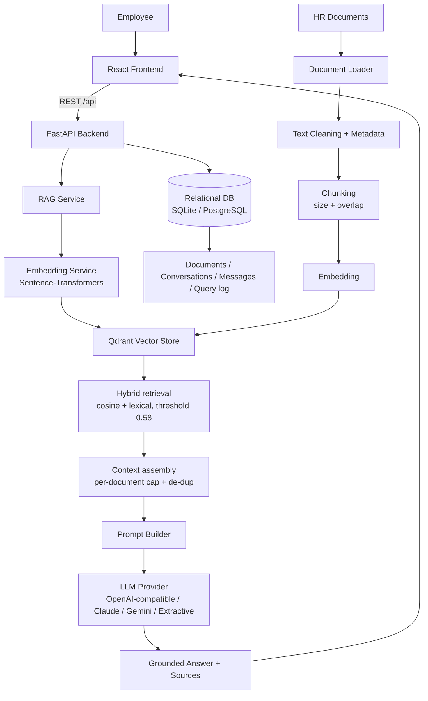
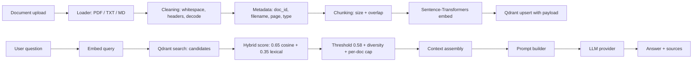
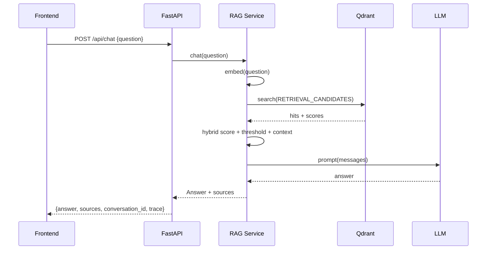
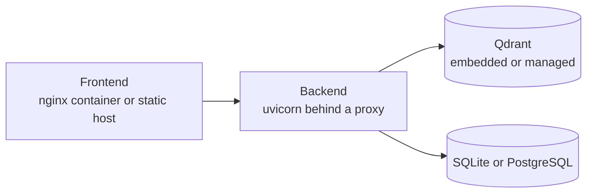

# HR Nexus — Architecture

> Intelligent HR Knowledge Assistant

This document describes how **HR Nexus** is actually built: the components, the
data and API flows, and the decisions behind them. Every path and flag named here
exists in the repository.

---

## 1. High-Level Architecture

### Components

| Component | Technology | Responsibility |
| --- | --- | --- |
| Frontend | React 18, TypeScript, Vite 5, Tailwind 3, Lucide | Chat / documents / dashboard UI, streamed answers, citations, light + dark themes |
| Backend API | FastAPI + Pydantic v2 + Uvicorn | REST + SSE API, validation, error envelope, orchestration |
| RAG Pipeline | Custom implementation (no LangChain/LlamaIndex) | load → clean → chunk → embed → index → retrieve → prompt → generate |
| Embeddings | Sentence-Transformers | Document + query embeddings; model warmed up once at startup, dimension checked against the collection |
| Vector Store | Qdrant (`qdrant-client`) | Vector storage with metadata payloads; embedded local mode or a Qdrant server |
| Relational DB | SQLAlchemy 2 (SQLite local / PostgreSQL) | Documents, conversations, messages, query telemetry |
| Answer providers | Provider abstraction over HTTP | Grounded generation; swappable without touching the RAG pipeline |

---

## 2. Frontend Architecture

Directory: `frontend/src/`

| Path | Responsibility |
| --- | --- |
| `api/client.ts` | Typed fetch client: all endpoints, upload progress via XHR, SSE parsing, in-memory management token |
| `api/types.ts` | TypeScript interfaces mirroring the Pydantic schemas |
| `state/AppContext.tsx` | Bootstrap state: meta, live stats, auth status, offline detection |
| `hooks/useTheme.ts` | Light/dark preference persisted in `localStorage` and applied to `<html data-theme>` |
| `components/AppShell.tsx` | Sidebar navigation, connection status, theme toggle, token lock, history drawer |
| `components/HistoryDrawer.tsx` | Conversation list, reopen, delete |
| `components/SourceList.tsx` | Citation cards with score bars, chunk metadata and "open the source file" |
| `components/Feedback.tsx` | Loading, empty, error and management-token gate states |
| `pages/ChatPage.tsx` | Streaming chat, conversation threading, suggestions, copy-to-clipboard |
| `pages/DocumentsPage.tsx` | Drag-and-drop upload, background-index polling, chunk preview, reindex, delete |
| `pages/DashboardPage.tsx` | Real corpus/vector/query metrics, system status, quick questions, recent queries |
| `index.css` | Design tokens: one ramp of CSS custom properties per theme, the `.panel` / `.btn-*` / `.field` / `.chip` primitives, and the glass layer (`.glass`, `.glass-card`, `.glass-inset`) |

**Key decisions**

- Colours come from CSS custom properties, so the dark and light palettes are the
  same components with a different set of tokens — the toggle changes one
  attribute on `<html>`.
- Depth is layered rather than painted: a fixed, non-interactive aurora of three
  heavily blurred colour fields sits behind the app, and cards are translucent
  surfaces with `backdrop-filter` plus a specular top edge. Nothing depends on
  `backdrop-filter` for legibility — it degrades to the translucent fill — and
  `prefers-reduced-motion` still overrides the transitions.
- No secret is ever compiled into the bundle. The management token is held in a
  module variable for the lifetime of the tab; a reload asks again by design.
- The frontend never fabricates metrics: every number comes from `/api/rag/stats`,
  `/api/documents` or `/api/rag/queries`.
- SSE conversation ids are adopted on the first `start` event and reused for
  later turns, so a thread stays one thread. They are carried in the query string
  so the route does not change mid-stream — see §6.

---

## 3. Backend Architecture

Directory: `backend/app/`

| Path | Responsibility |
| --- | --- |
| `core/config.py` | Pydantic settings from the environment, plus the root `.env` |
| `core/logging.py` | Structured logging with secret redaction |
| `core/security.py` | CORS, upload validation, safe filenames, bearer auth, rate limiters |
| `core/exceptions.py` | Domain exceptions and the `{detail, code}` error envelope |
| `database/session.py` | Engine, session scope, `init_db()` |
| `database/schema_sync.py` | Adds columns the models gained since an existing database was created |
| `models/entities.py` | `Document`, `Conversation`, `Message`, `QueryLog` |
| `schemas/` | Pydantic request/response models, one module per domain |
| `services/` | `DocumentService` (lifecycle + indexing), `ChatService` (threads, history, persistence) |
| `rag/loaders/` | PDF (PyMuPDF) / TXT / Markdown extraction, cleaning, page metadata |
| `rag/chunking/` | Recursive chunker with configurable size and overlap |
| `rag/embeddings/` | Lazily loaded embedding model with a cached dimension |
| `rag/vector_store/` | Qdrant adapter: upsert, search, delete by document, health |
| `rag/retrieval/` | Hybrid scoring, thresholding, diversification, context assembly |
| `rag/prompting/` | System instructions, history formatting, prompt bundle |
| `rag/generation/` | Provider abstraction: extractive, OpenAI-compatible, Anthropic, Gemini |
| `rag/pipeline.py` | Single entry point used by both the buffered and streaming endpoints |
| `api/routes/` | `health`, `meta`, `auth`, `chat`, `conversations`, `documents`, `rag` |
| `main.py` | Application factory, lifespan, request id + latency middleware |

### Concurrency model

FastAPI serves requests asynchronously; the CPU-bound work (parsing, chunking,
embedding, Qdrant I/O) is pushed to a worker thread so the event loop keeps
answering. Indexing after an upload runs as a background task and reports progress
through the document's `status`, not by blocking the request.

### Startup sequence

1. Configure logging.
2. `init_db()` — create missing tables, then add any column the models gained
   (`app/database/schema_sync.py`).
3. Instantiate the answer provider so a bad provider name or key fails visibly.
4. `pipeline.warmup()` — load the embedding model once, then validate the Qdrant
   collection's name, dimension and distance, recreating it if the embedding
   dimension changed.
5. Warn when `AUTH_REQUIRED` is set without a token, and when production runs the
   extractive provider.

---

## 4. RAG Architecture

### 4.1 Document ingestion

`POST /api/documents/upload` validates the file, stores it under `data/documents`
with a server-generated name, and returns immediately. A background task then
extracts, cleans, chunks, embeds and upserts into Qdrant while the document moves
through `pending → processing → ready | failed`. The UI polls the document list
only while something is still indexing, and the failure reason is persisted on the
row rather than logged and forgotten.

### 4.2 Chunking

- Recursive splitting on paragraph/sentence boundaries with `CHUNK_SIZE` (800) and
  `CHUNK_OVERLAP` (120).
- Chunk metadata: `document_id`, `filename`, `page`, `chunk_index`,
  `document_type`, `uploaded_at`.

### 4.3 Embeddings

- One model for documents and queries, `BAAI/bge-small-en-v1.5` (dimension 384) by
  default: small, fast, no external service.
- The model is loaded once during warm-up; every later request reuses it.

### 4.4 Vector store

- Qdrant via `qdrant-client`. With `QDRANT_URL=local` (or empty) the client uses
  its embedded persistence under `data/qdrant`, so no service is required.
- Collection name is configurable (`QDRANT_COLLECTION`, default `hr_documents`),
  cosine distance, metadata payloads.
- Re-indexing and deleting a document remove its vectors by a `document_id` filter,
  so a document can never leave orphaned chunks behind.

### 4.5 Retrieval

- The vector store returns `RETRIEVAL_CANDIDATES` (30) candidates; each is scored
  **hybrid** — `HYBRID_ALPHA` (0.65) × cosine similarity + 0.35 × lexical coverage
  of the question's content words.
- Chunks below `SCORE_THRESHOLD` (0.58) are discarded, at most
  `MAX_CHUNKS_PER_DOCUMENT` (2) chunks from one document survive, near-duplicates
  are dropped, and at most `MAX_CONTEXT_CHUNKS` (6) reach the prompt.
- The threshold is calibrated, not guessed: the bundled evaluation scores 26
  answerable questions and 6 out-of-scope ones, and 0.58 sits in the gap between
  the two distributions. Re-run it after changing the corpus, the chunker or the
  embedding model.
- Latency, hit count and top scores are recorded for the dashboard; a full trace is
  returned when `RAG_DEBUG=true`.

### 4.6 Generation

- If no chunk passes the threshold, the pipeline returns the configurable
  insufficient-knowledge response **without calling any model**. There is no
  prompt that can talk its way into an ungrounded answer.
- Otherwise the prompt is the system instructions plus the retrieved context plus
  the question (with up to `HISTORY_TURNS` previous user turns, so "and how many
  days carry over?" resolves).
- The extractive provider quotes the retrieved sentences and can therefore run
  fully offline; the hosted providers generate prose from the same grounded prompt.

---

## 5. Data Flow

1. HR uploads PDF/TXT/MD through the Documents page.
2. The pipeline extracts, cleans, chunks, embeds and indexes into Qdrant; the
   document reaches `ready` and the UI stops polling.
3. An employee asks a question in the Chat page.
4. The chat service embeds the question, pulls candidates, applies the hybrid
   threshold, and assembles context from the surviving chunks.
5. The provider writes an answer strictly grounded in that context; the sources
   returned are the exact chunks used.
6. Stages stream back over SSE (`start → retrieving → sources → generating →
   complete`) and the conversation is persisted for the history drawer.

---

## 6. API Flow

`POST /api/chat/stream` runs the identical pipeline and emits the stages as
Server-Sent Events, so the buffered and streaming paths cannot drift apart. The
`complete` event carries the answer, the sources that were actually used, and
follow-ups derived from those same sources — no second retrieval round-trip. The
client keeps the thread alive while that happens by putting the returned
conversation id in the **query string** (`/?conversation=<id>`) rather than the
path: changing the path re-keys the route element and would remount the chat
screen mid-answer. `/chat/<id>` remains supported for shared deep links.

---

## 7. Database

| Table | Purpose |
| --- | --- |
| `documents` | filename, type, size, status, error message, chunk/page counts, timestamps, metadata |
| `conversations` | chat threads with a title derived from the first question |
| `messages` | per-conversation user/assistant turns, JSON sources, `no_context`, latency |
| `query_logs` | truncated question preview plus retrieval latency, top score, provider, error |

Vectors are **only** stored in Qdrant; the relational database never holds an
embedding. Only a truncated question preview is logged — never the prompt, the
retrieved text or the answer.

Schema note: `create_all()` never alters an existing table, so
`app/database/schema_sync.py` runs at every boot and adds any column the models
have gained (`ALTER TABLE … ADD COLUMN`, additive only). Destructive changes still
require a real migration.

---

## 8. Deployment Architecture

- `docker compose up --build` serves the app on <http://localhost:8080> with the API
  on 8000; state lives in the `api-data` volume.
- Frontend is a static build (`npm run build`) served by nginx, which also proxies
  `/api` with `proxy_buffering off` so SSE is not swallowed.
- Backend runs `uvicorn app.main:app`; put it behind the platform's proxy and set
  `TRUST_PROXY_HEADERS=true`.
- `docs/DEPLOYMENT.md` covers single-host, split-origin and platform-specific notes.

---

## 9. Security Considerations

- Secrets only in environment variables (`QDRANT_API_KEY`, `LLM_API_KEY`,
  `DATABASE_URL`, `API_AUTH_TOKEN`); `.env` is git-ignored and the frontend bundle
  never contains one.
- CORS restricted to the `CORS_ORIGINS` allow-list.
- File uploads validated by extension, content type and size
  (`MAX_UPLOAD_SIZE_MB`), stored under server-generated names outside the web root.
- API errors are sanitised: clients get `{detail, code}`, never a stack trace.
- Logging redacts keys and API secrets.
- Write operations (upload, reindex, delete, conversation changes) require
  `Authorization: Bearer <API_AUTH_TOKEN>` when a token is configured; reading and
  asking questions stay open. `AUTH_REQUIRED=true` without a token fails closed.
- Rate limiting on reads (`RATE_LIMIT_PER_MINUTE`) and uploads
  (`RATE_LIMIT_UPLOADS_PER_MINUTE`). The limiter is in-process, so a multi-replica
  deployment needs a shared one.
- Not implemented: per-user accounts, roles, and audit trails. The token is a single
  shared secret for a trusted team, not user-level authorisation.

---

## 10. Observability

- RAG trace with retrieval latency, generation latency, total time, hit count and
  top scores (ids and scores, never raw documents) when `RAG_DEBUG=true`.
- Structured logs with a request id on every request (`X-Request-ID`).
- `/api/rag/stats` reports real document, chunk, vector and query counts;
  `/api/rag/queries` lists recent questions with their outcome.

---

## 11. Testing & QA

- Backend: `pytest` (scoring, chunking, provider and schema-sync unit tests),
  `python -m evaluation.evaluate_rag` (32-case retrieval and refusal suite) and
  `python -m tests.smoke` (50 assertions against a live server).
- Frontend: `npm run typecheck`, `npm test` (40 tests), `npm run build`.
- `docs/TESTING.md` has the full list and what each layer covers.

---

## 12. Deliberate deviations

- **SQLite by default** so the project runs with no infrastructure;
  `DATABASE_URL` switches to PostgreSQL. The models are portable and nothing is
  SQLite-specific.
- **Embedded Qdrant by default** (`QDRANT_URL=local`) so the full vector pipeline
  works with no server; point `QDRANT_URL` at Qdrant Cloud or a cluster to move.
- **Extractive provider as the default answer mode**: deterministic, offline and
  incapable of inventing anything, which is what makes the test suite meaningful.
  Production runs that mode only with a loud startup warning — the API reports
  `features.extractive` so the UI labels the mode instead of implying generated
  prose.
- **No LangChain/LangGraph.** The pipeline is ~600 lines of explicit Python, which
  is what makes the threshold, the refusal path and the streaming stages auditable.
- **Docker assets are provided but were not executed here** — Docker was not
  installed on the machine that built this. They are documented in
  `docs/DEPLOYMENT.md` and should be run once before relying on them.