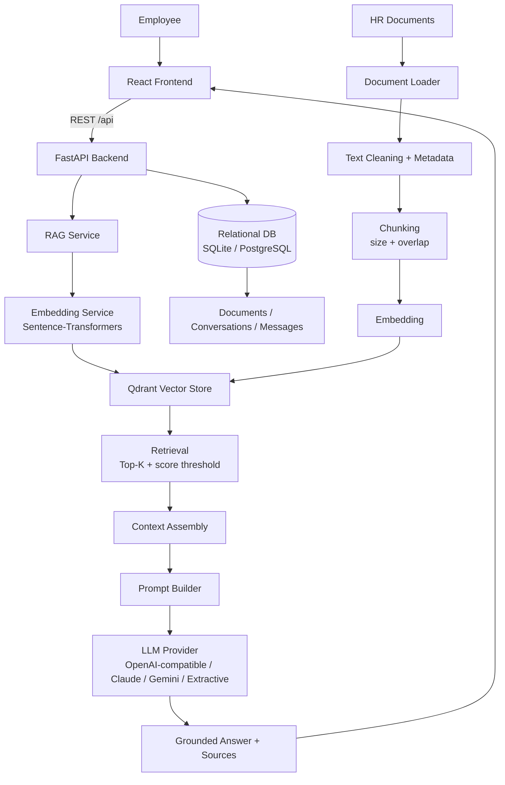
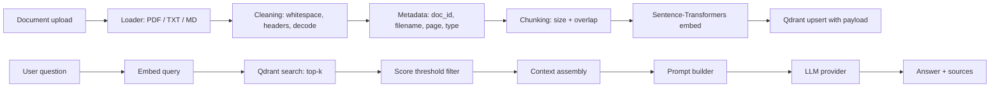
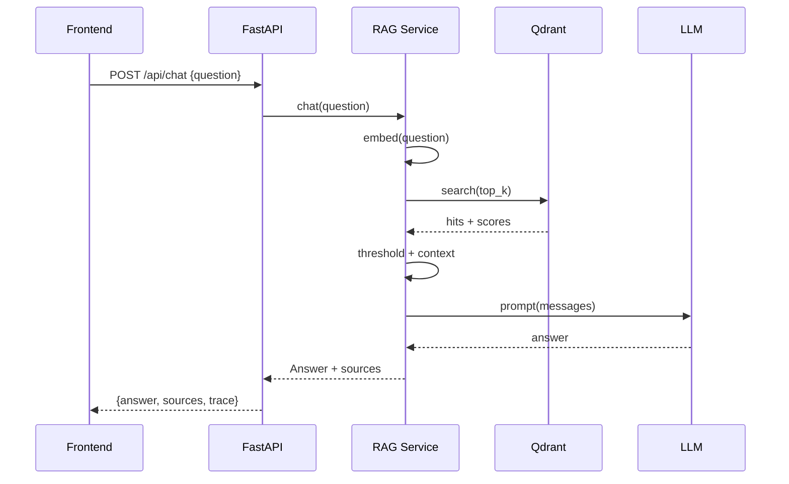
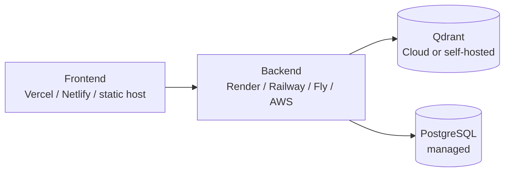

# HR Nexus — Architecture

> Intelligent HR Knowledge Assistant

This document describes the current project structure, the proposed (and implemented) architecture, and the data / API flows of **HR Nexus**.

---

## 1. Repository State (before implementation)

At the time of writing, the repository contained only a placeholder `README.md` and a git history with a single initial commit. There was **no existing frontend, backend, or dependency manifest**, so the project was built from a clean slate. No existing functionality needed to be preserved.

| Aspect | State |
| --- | --- |
| Frontend | None — created from scratch (React + Vite + Tailwind) |
| Backend | None — created from scratch (FastAPI) |
| Vector store | None — Qdrant embedded/local mode (configurable to a Qdrant server) |
| Application DB | None — SQLAlchemy + SQLite locally, PostgreSQL in production |
| Deployment | None — Docker compose provided, no provider hard-coded |

---

## 2. High-Level Architecture

### Components

| Component | Technology | Responsibility |
| --- | --- | --- |
| Frontend | React 18, TypeScript, Vite, Tailwind, Framer Motion, Lucide | Premium glassmorphism chat / dashboard / document-management UI |
| Backend API | FastAPI + Pydantic + Uvicorn | REST API, validation, error handling, orchestration |
| RAG Pipeline | Custom implementation (no LangChain/LlamaIndex) | Load → clean → chunk → embed → index → retrieve → prompt → generate |
| Embeddings | Sentence-Transformers (configurable model) | Document + query embeddings; dimension validated at startup |
| Vector Store | Qdrant (`qdrant-client`) | Persistent vector storage with metadata payloads |
| Relational DB | SQLAlchemy 2 (SQLite local / PostgreSQL prod) | Documents, conversations, messages, jobs |
| LLM | Provider abstraction (HTTP) | Grounded generation; providers swappable without touching RAG |

---

## 3. Frontend Architecture

Directory: `frontend/`

| Path | Responsibility |
| --- | --- |
| `src/components/` | Reusable UI primitives (GlassCard, GlassButton, ChatMessage, SourceCard, DocumentCard, UploadZone, Sidebar, Header, StatusIndicator, LoadingIndicator, EmptyState, ErrorState, Markdown, Toast) |
| `src/layouts/` | App shell, responsive layout with sidebar + content area |
| `src/pages/` | Dashboard, Chat, Documents, Knowledge (stats/observability) |
| `src/hooks/` | `useTheme`, `useChat`, `useDocuments`, `useKnowledgeStatus`, `useToast`, `useMediaQuery`, `useReducedMotion` |
| `src/services/` | typed API client (`api.ts`) + domain services |
| `src/types/` | shared TypeScript types mirroring backend schemas |
| `src/utils/` | format helpers, cn() class combiner |
| `src/animations/` | reusable Framer Motion variants (respecting reduced-motion) |
| `src/styles/` | Tailwind theme tokens + global CSS |

**Key decisions**

- Design tokens are centralized and themed (`design system` below).
- No API keys live in frontend code; all secrets stay server-side.
- The frontend never fabricates metrics: every stat is fetched from `/api/rag/stats` or `/api/documents`.

---

## 4. Backend Architecture

Directory: `backend/app/`

| Path | Responsibility |
| --- | --- |
| `core/config.py` | Pydantic settings from environment variables |
| `core/logging.py` | Structured logging, secret redaction |
| `core/security.py` | CORS, file validation, safe names, rate-limit scaffolding |
| `core/exceptions.py` | Domain exceptions + error handling helpers |
| `database/` | SQLAlchemy engine, session, models |
| `models/` | Documents, Conversations, Messages |
| `schemas/` | Pydantic request/response models |
| `services/` | DocumentService, ChatService, StatsService |
| `rag/loaders/` | PDF/TXT/MD extraction + cleaning |
| `rag/chunking/` | Text chunking with size/overlap |
| `rag/embeddings/` | Embedding service (lazy model load, dimension check) |
| `rag/vector_store/` | Qdrant client wrapper (create/insert/search/delete/health) |
| `rag/retrieval/` | Semantic search, thresholding, context assembly |
| `rag/prompting/` | System prompt + context formatting |
| `rag/generation/` | LLM provider abstraction + answer parsing |
| `api/` | FastAPI routers (health, chat, documents, conversations, rag) |
| `main.py` | Application factory, lifespan, CORS, middleware |

### Concurrency model

FastAPI runs async; embedding and chunking are CPU-bound and run in a `ThreadPoolExecutor` (`run_in_threadpool`) so the event loop is never blocked blockingly.

### Startup validation

On startup the app:
1. Initialises the embedding model (lazy, on first use).
2. Validates the embedding dimension against the Qdrant collection; recreates the collection if the dimension changed.
3. Runs a Qdrant health/connectivity check.

---

## 5. RAG Architecture

### 5.1 Document ingestion

`POST /api/documents/upload` → file persisted to `data/documents` → extraction → cleaning → chunking → embedding → Qdrant upsert. Document record + chunk count stored in relational DB. Status transitions: `pending → processing → ready | failed`.

### 5.2 Chunking

- Recursive splitting on paragraph/sentence boundaries with configurable `CHUNK_SIZE` (default 800) and `CHUNK_OVERLAP` (default 120).
- Chunk metadata: `document_id`, `filename`, `page`, `chunk_index`, `document_type`, `uploaded_at`.

### 5.3 Embeddings

- Same model for documents and queries (requirement).
- Default model `BAAI/bge-small-en-v1.5` (dimension 384) — small, fast, strong retrieval quality.
- Embeddings computed in a worker thread; results reused — never recomputed on every request.

### 5.4 Vector store

- Qdrant via `qdrant-client`. If `QDRANT_URL` is `local`/empty, uses built-in local persistence at `data/qdrant` (perfect for dev/demo without Docker).
- Collection name configurable (`QDRANT_COLLECTION`), cosine distance, payload metadata.
- Deleting/re-indexing a document removes its vectors by `document_id` filter.

### 5.5 Retrieval

- Query embedding → Qdrant search `top_k` → filter by optional `score_threshold` → build context with source metadata (filename, page, chunk).
- Retrieval is LLM-agnostic. Latency and scores logged for observability.

### 5.6 Generation

- If no chunks pass the score threshold, the pipeline returns the configurable *insufficient-knowledge* response **without calling the LLM**.
- Otherwise the prompt builder composes system instructions + retrieved context + question, and the LLM provider generates a grounded answer with inline citations that the frontend renders as source chips.

---

## 6. Data Flow

1. HR uploads PDF/TXT/MD through the Documents page.
2. The pipeline extracts, cleans, chunks, embeds and indexes into Qdrant.
3. An employee asks a question in the Chat page.
4. The chat service embeds the question, retrieves top-k chunks, applies threshold, builds context + prompt.
5. The LLM writes an answer strictly grounded in context; sources are always real.
6. The answer + sources stream back to the UI; conversation persisted.

---

## 7. API Flow

---

## 8. Database

| Table | Purpose |
| --- | --- |
| `documents` | filename, type, size, status, chunk_count, timestamps, metadata |
| `conversations` | chat sessions |
| `messages` | per-conversation user/assistant turns incl. JSON sources |
| `health_checks` | app health snapshots (optional) |

Vectors are **only** stored in Qdrant. PostgreSQL (or SQLite) never stores embeddings.

---

## 9. Deployment Architecture

- Frontend is a static build (`npm run build`).
- Backend runs `uvicorn app.main:app` behind the host's reverse proxy.
- Both can be launched locally with Docker Compose (app, qdrant, postgres optional).
- See `docs/DEPLOYMENT.md` for details.

---

## 10. Security Considerations

- Secrets only in environment variables (`QDRANT_API_KEY`, `LLM_API_KEY`, `DATABASE_URL`); `.env` is git-ignored.
- CORS restricted to `FRONTEND_URL` allow-list.
- File uploads validated by extension + magic bytes and size limit (`MAX_UPLOAD_SIZE_MB`).
- Safe server-generated file names (uuid prefix), stored outside web root.
- API errors sanitised (no stack traces/secret leakage to clients).
- Logging redacts keys and API secrets.
- AuthN/AuthZ-ready: role constants and optional API token (`API_AUTH_TOKEN`) enforced on document management endpoints.
- Rate-limiting scaffold present (`app/core/security.py`) and middleware ready for a Redis-backed limiter in production.

---

## 11. Observability

- RAG trace payload with retrieval latency, LLM latency, total time, chunk count, and top scores (ids + scores, no raw docs) returned when `RAG_DEBUG=true`.
- Structured logs with request ids.
- `/api/rag/stats` reports real document/chunk/vector counts.

---

## 12. Testing & QA

- Backend: `pytest` (unit + integration with local Qdrant + extractive LLM provider).
- Frontend: Vitest + React Testing Library.
- See `docs/TESTING.md`.

---

## 13. Adaptations vs. the original plan

- **SQLite default** for frictionless local dev (no Docker required); `DATABASE_URL` can point at PostgreSQL for production. SQLAlchemy models are portable.
- **Qdrant local mode** default so the full vector pipeline runs without an external server; `QDRANT_URL` switchable to a Qdrant server/cloud.
- **Extractive LLM provider** for offline testing/CI: a deterministic, real generator that answers strictly from retrieved context. Production uses a hosted provider; never used as a silent default in production (`APP_ENV=production` rejects it with a clear error).
- No Docker available on the dev machine → verified locally with pip/node; Docker files provided and validated for syntax.